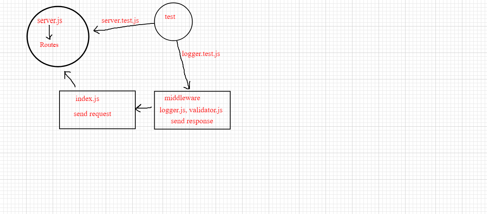

# basic-api-server

## .env requirements (where applicable)
PORT - 8080

## NODE.JS

Node.js allows users to build JavaScript applications
REPL Read, Evaluate, Print, Loop
Node.js comes with a basic REPL

## What is NPM?

Node Package Management system: It is an ecosystem of applications that help developers create applications with packages

NPM Init -y: Installs package.json file

## Tests Handlers: Is the location where error's are handled. Handlers aslo will be where we put the routes for servers 404 is route not found 500 server error

## CI CD: Continuos Intergration and Continuous Deployment

## deppendicies vs devDependiceis
### "dependencies": Packages required by your application in production.
### "devDependencies": Packages that are only needed for local development and testing.

## steps :

* ### npm i jest

* ### add start scripts : "node index.js"

* ### add test scripts : "jest"

* ### add folder outside tests add file server.test.js

* ### commands to devDependencies npm i -D supertest

## Execute:

* ### Setup a Node.js Package using npm

* ### Create CommonJS modules

* ### Create a simple express server

* ### See passing tests via GitHub actions (CI)

* ### Deploy to Heroku using CD

main branch Heroku url: https://basicapi-server.herokuapp.com/

pull request link: https://github.com/saleem-ux/basic-api-server/pull/4

GitHub Actions link : https://github.com/saleem-ux/basic-api-server/actions

## Diagram 

